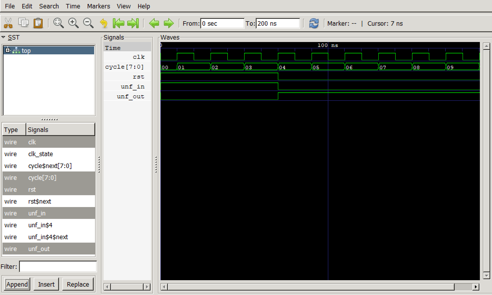

# Simulating

The best way to simulate a module is through the use of yosys. In brief:

1. Create a top-level module with your module to simulate as a submodule. The top-level module should define one or more local `clk` signals, a local `rst` signal, and your clock domains whose clocks and resets are referenced to the local `clk` and `rst` signals. The local reset signal should be declared `reset_less`.
2. Create local resetless signals for every input port to your module, and copy them in combinatorically.
3. Create a resetless cycle counter that increments on the positive edge of `clk`.
4. In the top-level module, add some helper functions to set up the input signal schedule.
5. Set up the input signal schedule.
6. Set up a `Cover` statement to cover the case where the cycle count is high enough.
7. Set up an `sby` file.
8. Generate RTLIL for the top-level module:

   ```
   $ python3 toplevel.py generate -t il > toplevel.il
   ```
9. Run Symbiyosys on the output:

   ```
   $ sby -f toplevel.sby
   ```

   Symbiyosys should run, incrementing the cycle count.
10. View the output with `gtkwave`.

## 1. Top-level module

Define a ports function in your module which returns an array of your module's ports:

```python
class YourModule(Elaboratable):
    ...
    def ports(self):
        return [self.yourmodule.p1, self.yourmodule.p2, ...]
```

Now create a test file:

```python
from nmigen import *
from nmigen.cli import main

#
# For a module that has only one clock:
#

if __name__ == "__main__":
    clk = Signal()
    rst = Signal(reset=1, reset_less=True)

    sync = ClockDomain()
    sync.clk = clk
    sync.rst = rst

    yourmodule = YourModule()

    m = Module()
    m.domains += sync
    m.submodules.yourmodule = yourmodule

    main(m, ports=[clk, rst] + yourmodule.ports())


#
# For a module that has one clock but logic for both positive and negative edges:
#

if __name__ == "__main__":
    clk = Signal()
    rst = Signal(reset=1, reset_less=True)

    pos = ClockDomain()
    pos.clk = clk
    pos.rst = rst

    neg = ClockDomain(clk_edge="neg")
    neg.clk = clk
    neg.rst = rst

    yourmodule = YourModule()

    m = Module()
    m.domains.pos = pos
    m.domains.neg = neg
    m.submodules.yourmodule = yourmodule

    main(m, ports=[clk, rst] + yourmodule.ports())
```

## 2. Resetless input signals

For every port in your module that you want to stimulate, create a local signal (usually with the same name), declaring it resetless. Choose an initial reset value, too. Then hook them up to your module's inputs.

```python
    ...

    m.submodules += toplevel

    input1 = Signal(reset=0, reset_less=True)
    input2 = Signal(unsigned(8), reset=0xFF, reset_less=True)

    m.d.comb += [
        toplevel.input1.eq(input1),
        toplevel.input2.eq(input2),
    ]

    main(m, ports=[clk, rst] + toplevel.ports)
```

## 3. Resetless cycle counter

This counter will be used as a time count. It will increment it on every positive edge of your main clock.

```python
    ...

    m.d.comb += [
        toplevel.input1.eq(input1),
        toplevel.input2.eq(input2),
    ]

    cycle = Signal(unsigned(8), reset_less=True)
    m.d.pos += cycle.eq(cycle + 1)

    main(m, ports=[clk, rst] + toplevel.ports)
```

## 4. Helper functions

Copy in these functions, which will help you to create a signal schedule:

```python
    ...

    import itertools

    def delay(d):
        for _ in range(d):
            yield None

    def generate_signals(gen):
        with m.Switch(cycle+1):
            c = 0
            ss = []
            for s in gen():
                if s is not None:
                    ss.append([s])
                    continue
                c += 1
                ss = list(itertools.chain(*ss)) # Flatten list
                if len(ss) > 0:
                    with m.Case(c):
                        m.d.pos += ss
                ss = []

    main(m, ports=[clk, rst] + toplevel.ports)
```

## 5. Input signal schedule

We can now create the input signal schedule. It is a generator where you yield signal settings or delays. Using `yield from delay(n)` will delay `n` cycles. For example:

```python
    ...

    def signal_generator():
        yield from delay(3)
        yield [rst.eq(0), input1.eq(1)]
        yield input2.eq(0x4A)
        yield from delay(1)
        yield input2.eq(0x4B)
        yield from delay(1)

    generate_signals(signal_generator)

    main(m, ports=[clk, rst] + toplevel.ports)
```

In the above example, we do nothing for three cycles, then set `rst` to 0, `input1` to 1, and `input2` to 0x4A. Then we wait one cycle, and set `input2` to 0x4B.

You are required to have a `yield from delay(n)` for at least one cycle before exiting the generator in order to "flush" the last signal setting. If you don't see the last settings taking effect, suspect that you have not yielded a delay at the end of your generator.

Then call `generate_signals` with your generator in order to set up the logic to generate the signals according to your schedule.

Note that it is possible to have two generators and combine them -- just use `zip` and `itertools.chain` and make sure that any `None`s in the list are removed, and that an empty list results in yielding `None`.

```python
    import itertools

    def signal_generator1():
        ...

    def signal_generator2():
        ...

    def signal_generator():
        for x, y in zip(signal_generator1(), signal_generator2()):
            ss = [x, y]
            ss = list(itertools.chain(*ss)) # Flatten list
            ss = [s for s in ss if s not None] # Remove Nones
            yield s if s else None
```

## 6. Set up the Cover statement

We're going to run Symbiyosys in cover mode, which means it will attempt to find the shortest sequence of input signals to get to the cover condition. Since our only cover condition will be that the cycle count reaches some value, the way to get there is to just cycle the clock. That increments the cycle counter, which drives the signal generator.

Here we're just going to cycle the clock 10 times:

```python
    ...

    generate_signals(signal_generator)

    m.d.comb += Cover(cycle == 10)

    main(m, ports=[clk, rst] + toplevel.ports)
```

## 7. Set up an sby file

This is the configuration file for Symbiyosys. Call it `<yourmodule>.sby`.

```
[tasks]
cover

[options]
cover: mode cover
# This must be at least twice the cycle count
cover: depth 25
multiclock on

[engines]
smtbmc boolector

[script]
read_ilang toplevel.il
prep -top top

[files]
toplevel.il
```

## 8. Generate RTLIL for the top-level module:

```
$ python3 toplevel.py generate -t il > toplevel.il
```

## 9. Run Symbiyosys on the output:

```
$ sby -f <yourmodule>.sby
```

This reads in `toplevel.il` and runs coverage. You should see something like this:

```
SBY  5:55:32 [edgelord_cover] engine_0: starting process "cd edgelord_cover; yosys-smtbmc -s boolector --presat --unroll -c --noprogress -t 20 --append 0 --dump-vcd engine_0/trace%.vcd --dump-vlogtb engine_0/trace%_tb.v --dump-smtc engine_0/trace%.smtc model/design_smt2.smt2"
SBY  5:55:32 [edgelord_cover] engine_0: ##   0:00:00  Solver: boolector
SBY  5:55:32 [edgelord_cover] engine_0: ##   0:00:00  Checking cover reachability in step 0..
SBY  5:55:32 [edgelord_cover] engine_0: ##   0:00:00  Checking cover reachability in step 1..
...
SBY  5:55:32 [edgelord_cover] engine_0: ##   0:00:00  Checking cover reachability in step 18..
SBY  5:55:32 [edgelord_cover] engine_0: ##   0:00:00  Checking cover reachability in step 19..
SBY  5:55:32 [edgelord_cover] engine_0: ##   0:00:00  Reached cover statement at edgelord.py:147 in step 19.
SBY  5:55:32 [edgelord_cover] engine_0: ##   0:00:00  Writing trace to VCD file: engine_0/trace0.vcd
SBY  5:55:32 [edgelord_cover] engine_0: ##   0:00:00  Writing trace to Verilog testbench: engine_0/trace0_tb.v
SBY  5:55:33 [edgelord_cover] engine_0: ##   0:00:00  Writing trace to constraints file: engine_0/trace0.smtc
SBY  5:55:33 [edgelord_cover] engine_0: ##   0:00:00  Status: PASSED
SBY  5:55:33 [edgelord_cover] engine_0: finished (returncode=0)
SBY  5:55:33 [edgelord_cover] engine_0: Status returned by engine: PASS
SBY  5:55:33 [edgelord_cover] summary: Elapsed clock time [H:MM:SS (secs)]: 0:00:01 (1)
SBY  5:55:33 [edgelord_cover] summary: Elapsed process time [H:MM:SS (secs)]: 0:00:01 (1)
SBY  5:55:33 [edgelord_cover] summary: engine_0
```

The important bit is `Reached cover statement`, which shows that Symbiyosys was able to sequence the clock signal so that the cycle counter reached the desired value. Note that each step is one change of the clock, so a full cycle requires two steps.

## 10. View the output

Symbiyosys places the trace file in `<module>_cover/engine_0/trace0.vcd`. Running `gtkwave` (or `gtkwave.exe` for Windows) will let you display the traces.

```
$ gtkwave <module>_cover/engine_0/trace0.vcd
```



# Dealing with more complex clocks

If you have more than one clock, and they are related, you can trigger them off of a master clock. Here is a full example showing how to set up your clocks. There is also a cover statement to show how the system gets to a particular state.

Suppose we have a two-clock system where synchronous actions happen on the positive edge of phase 1 and on the negative edge of phase 2.

```python
from nmigen import *
from nmigen.cli import main
from nmigen.asserts import *


class TestCase(Elaboratable):
    def __init__(self):
        self.ph1_val = Signal(4)
        self.ph2_val = Signal(4)

    def elaborate(self, platform):
        m = Module()
        m.d.ph1 += self.ph1_val.eq(self.ph1_val + 1)
        m.d.ph2 += self.ph2_val.eq(self.ph2_val + 1)
        return m


if __name__ == "__main__":
    m = Module()
    testcase = TestCase()

    # Two clocks, out of phase:
    #
    # ph1: ____|`|_____|`|_____|`|___
    #
    # ph2: |`|_____|`|_____|`|_____|`|___
    #
    # phase:  0 1 2 3 0 1 2 3 0 1 2 3
    #
    # We want the system to perform actions on
    # the positive edge of ph1, and the negative
    # edge of ph2.

    # The "master clock" already exists in nMigen. The
    # domain is named "sync" and its clock is named "clk".
    rst = Signal(reset=1, reset_less=True)

    # Define the two clocks
    clk1 = Signal(reset=0, reset_less=True)
    ph1 = ClockDomain("ph1")
    ph1.clk = clk1
    ph1.rst = rst
    m.domains += ph1

    clk2 = Signal(reset=0, reset_less=True)
    ph2 = ClockDomain("ph2", clk_edge="neg")
    ph2.clk = clk2
    ph2.rst = rst
    m.domains += ph2

    # Count out four phases and set the two clocks so
    # that they look right. Without this, yosys is free
    # to align the edges of the clocks however it wants.
    # You might think, therefore, that some Assumes are
    # all we need here, but apparently not. Perhaps yosys
    # ignores Assume statements with clocks in them.
    phase = Signal(2, reset=0, reset_less=True)
    m.d.sync += phase.eq(phase + 1)
    m.d.sync += clk1.eq(phase == 1)
    m.d.sync += clk2.eq(phase == 3)

    m.submodules += testcase

    # Cycle counter
    cycle = Signal(unsigned(8), reset_less=True)
    m.d.sync += cycle.eq(cycle + 1)

    # Force a reset at the beginning
    with m.If(cycle < 4):
        m.d.comb += Assume(rst)

    m.d.comb += Cover((testcase.ph1_val == 4) & (testcase.ph2_val == 4))

    main(m, ports=[clk, rst, clk1, clk2, testcase.ph1_val, testcase.ph2_val])
```

Notice that if we don't care so much about seeing the phase 1 and phase 2 clocks, we can simply go with one clock, and perform synchronous actions on both positive and negative edges as above. Simulation and formal verification would run _four times as fast_ because there will be one tick of the global clock per action instead of four. However, you wouldn't see the lopsided effect of the timing. Here's a version of the above file that defines a `GOFASTER` flag.

```python
from nmigen import *
from nmigen.cli import main
from nmigen.asserts import *

GOFASTER = 1

class TestCase(Elaboratable):
    def __init__(self):
        self.ph1_val = Signal(4)
        self.ph2_val = Signal(4)

    def elaborate(self, platform):
        m = Module()
        m.d.ph1 += self.ph1_val.eq(self.ph1_val + 1)
        m.d.ph2 += self.ph2_val.eq(self.ph2_val + 1)
        return m


if __name__ == "__main__":
    m = Module()
    testcase = TestCase()

    # Two clocks, out of phase:
    #
    # ph1: ____|`|_____|`|_____|`|___
    #
    # ph2: |`|_____|`|_____|`|_____|`|___
    #
    # phase:  0 1 2 3 0 1 2 3 0 1 2 3
    #
    # We want the system to perform actions on
    # the positive edge of ph1, and the negative
    # edge of ph2.

    # The "master clock" already exists in nMigen. The
    # domain is named "sync" and its clock is named "clk".
    rst = Signal(reset=1, reset_less=True)

    # Define the two clocks
    if GOFASTER:
        clk1 = Signal(reset=0, reset_less=True)
        ph1 = ClockDomain()
        ph1.clk = clk1
        ph1.rst = rst
        m.domains += ph1

        clk2 = clk1
        ph2 = ClockDomain(clk_edge="neg")
        ph2.clk = clk2
        ph2.rst = rst
        m.domains += ph2
    else:
        clk1 = Signal(reset=0, reset_less=True)
        ph1 = ClockDomain("ph1")
        ph1.clk = clk1
        ph1.rst = rst
        m.domains += ph1

        clk2 = Signal(reset=0, reset_less=True)
        ph2 = ClockDomain("ph2", clk_edge="neg")
        ph2.clk = clk2
        ph2.rst = rst
        m.domains += ph2

    phase = Signal(2, reset=0, reset_less=True)
    if GOFASTER == 0:
        # Count out four phases and set the two clocks so
        # that they look right. Without this, yosys is free
        # to align the edges of the clocks however it wants.
        # You might think, therefore, that some Assumes are
        # all we need here, but apparently not. Perhaps yosys
        # ignores Assume statements with clocks in them.
        m.d.sync += phase.eq(phase + 1)
        m.d.comb += clk1.eq(phase == 1)
        m.d.comb += clk2.eq(phase == 3)

    m.submodules += testcase

    # Cycle counter
    cycle = Signal(unsigned(8), reset_less=True)
    m.d.sync += cycle.eq(cycle + 1)

    # Force a reset at the beginning
    with m.If(cycle < 4):
        m.d.comb += Assume(rst)

    m.d.comb += Cover((testcase.ph1_val == 4) & (testcase.ph2_val == 4))

    main(m, ports=[clk, rst, clk1, clk2, testcase.ph1_val, testcase.ph2_val])
```
